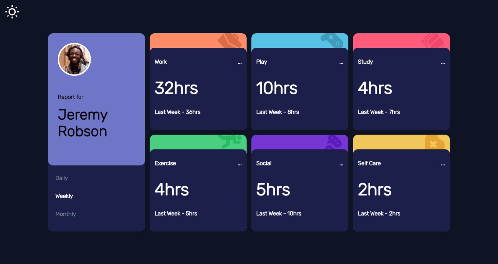

# Frontend Mentor - Time tracking dashboard solution

This is a frontend project created for Ragam Inductions 2025 with the help of frontendmentor.io 

## Table of contents

- [Overview](#overview)
  - [The challenge](#the-challenge)
  - [Screenshot](#screenshot)
  - [Links](#links)
- [My process](#my-process)
  - [Built with](#built-with)
  - [What I learned](#what-i-learned)
  - [Continued development](#continued-development)
  - [Useful resources](#useful-resources)
- [Author](#author)
- [Acknowledgments](#acknowledgments)

## Overview

### The challenge

Users should be able to:

- View the optimal layout for the site depending on their device's screen size
- See hover states for all interactive elements on the page
- Switch between viewing Daily, Weekly, and Monthly stats

### Screenshot

### Links

- Solution URL: [Add solution URL here](https://github.com/SreehariSanjeev04/ragam_inductions)
- Live Site URL: [Add live site URL here](https://ragam-inductions.vercel.app/)

## My process

### Built with

- Semantic HTML5 markup
- CSS custom properties
- Flexbox
- CSS Grid
- Mobile-first workflow
- [React](https://reactjs.org/) - JS library

### What I learned

I am deeply pleased with my work, especially by the fact that I got to a learn a lot about styling and frontend in general.

### Continued development

Planning to connect with backend for creating a full-fledged application.

### Useful resources

-  - This helped me with basic Javascript lessons. I really liked this pattern and will use it going forward.

## Author

- Website - [Sreehari Sanjeev](https://sreeharisanjeev04.github.io/Portfolio/)

